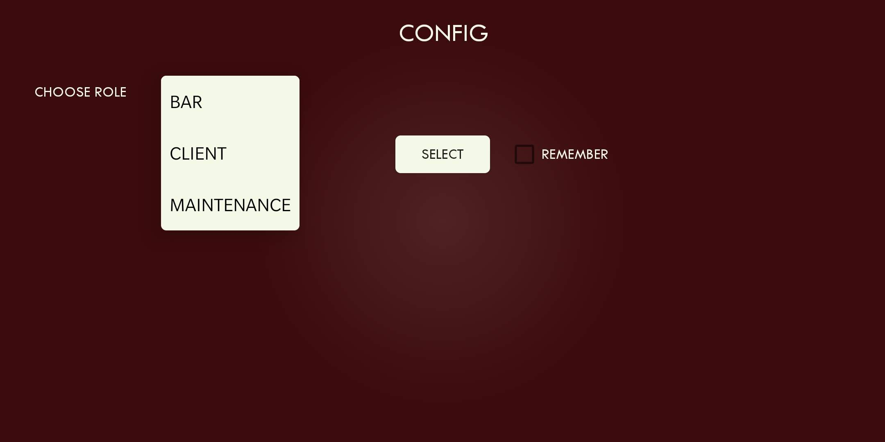
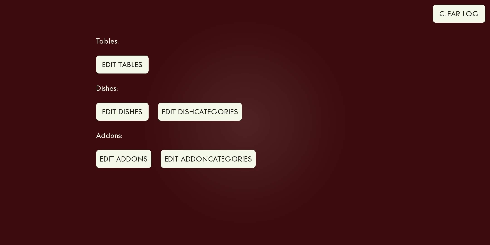
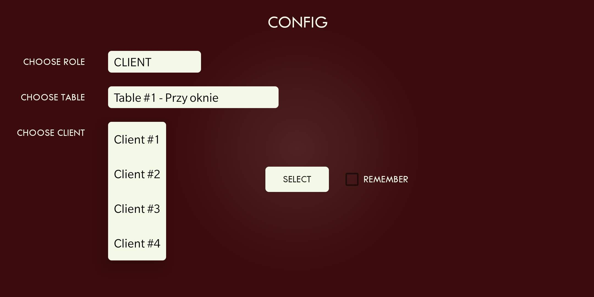
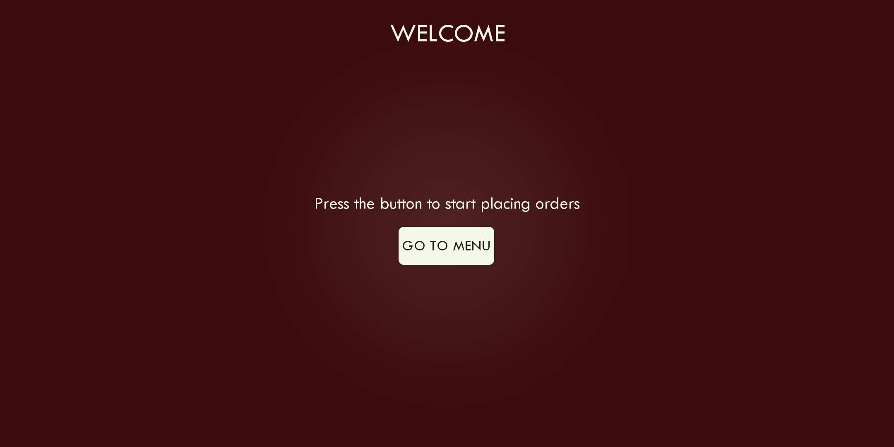
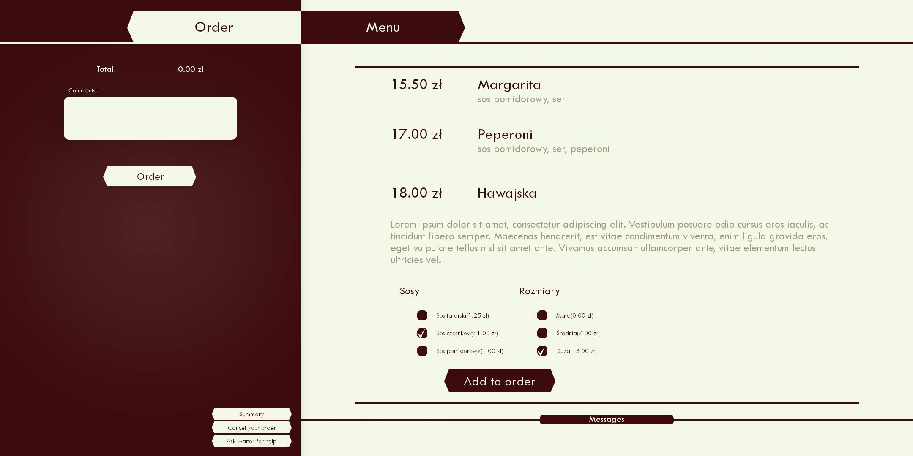
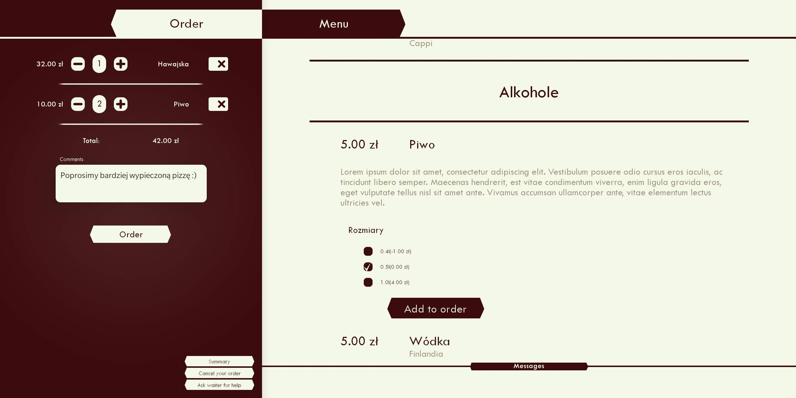
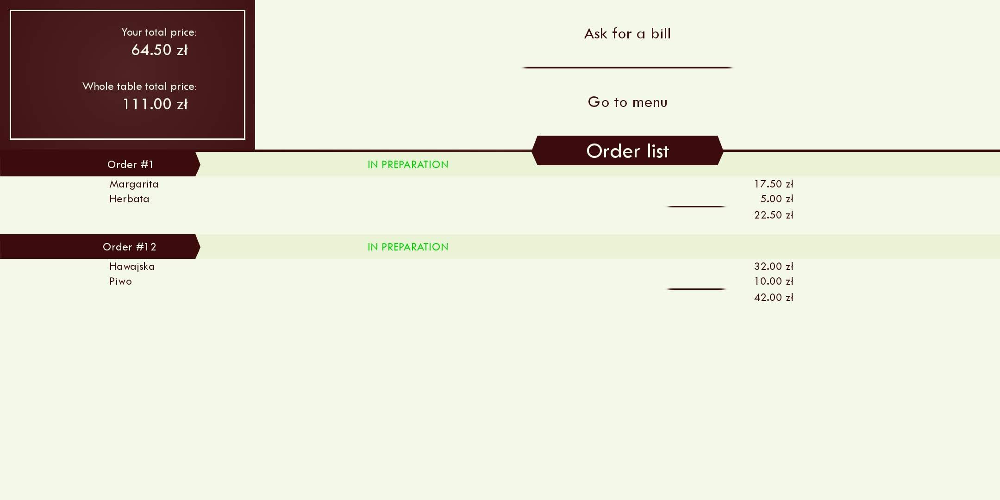
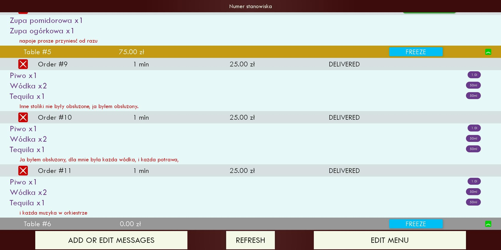
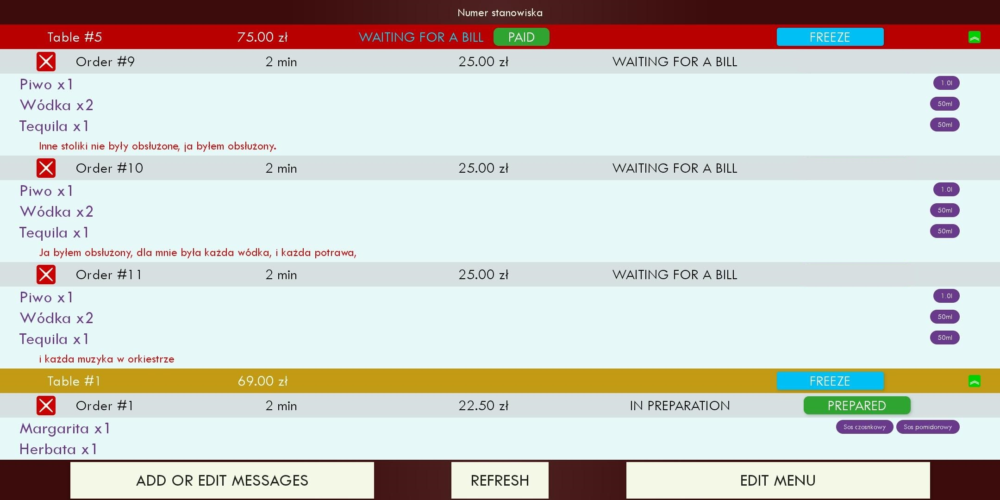
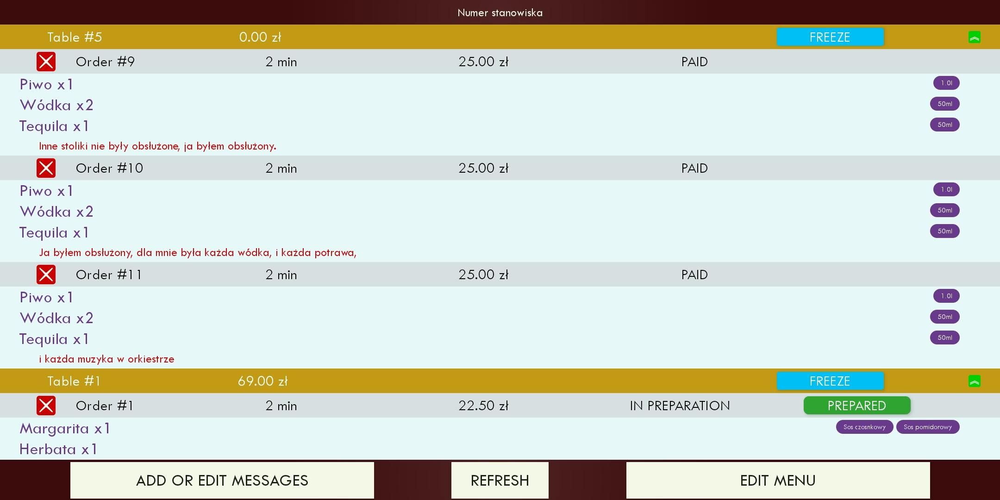

# Orderify
Application to manage restaurant involving taking client's orders, informing kitchen staff about orders and displaying their pay requests. <br/>
<p align="center">
  
  
</p>

<p align="center">
  
  
</p>

<p align="center">
  
  
  
</p>

<p align="center">
  
  
  
</p>

### Download
All releases of the game are avaliable on the github page in the [releases](https://github.com/msuliborski/name/releases) tab. 

## Getting Started
These instructions will get you a copy of the project up and running on your local machine for development and testing purposes.

### Prerequisites
* Install [Android Studio](https://developer.android.com/studio)
* Install and configured locally available MySQL server.
* [Optional] Install [MySQL Workbench](https://dev.mysql.com/downloads/workbench/) for easy access to databse.
    
### MySQL Server 
Install MySQl Server: 
```
sudo apt install mysql-server
```
Log in:
```
sudo mysql -p -u root   (bez hasla)
```
Create user with privileges:
```
CREATE USER 'root'@'%' IDENTIFIED BY '1234';
GRANT ALL PRIVILEGES ON *.* TO 'root'@'%';
flush privileges;
```
Modify configuration
```
sudo nano /etc/mysql/mysql.d/mysql.conf
OR
sudo nano /etc/mysql/mysql.conf.d/mysqld.cnf     <--- pref this
```
Comment out `bind-address`. It should look like this after the change:
```
bind-address = 127.0.0.1
```
Restart MySQL Service
```
sudo /etc/init.d/mysql restart
OR 
sudo service mysql restart
```
To access MySQL locally
```
mysql -p -u root
```
To access MySQL remotely 
```
mysql -h 192.168.1.100 -u root -p Orderify
```

### Prepare database
To work properlly application needs pre-configured database.
Execute this [script](@database/orderify.sql), it creates all tables and populates them with examplatory data.


### Cloning
```
$ git clone https://github.com/msuliborski/orderify
```

### Building
Open project in Android Studio and install all dependencies needed. Currently project is compatible with Android 10 (SDK 29).

### Usage
* Each instance of the application can have specified role
    * `Bar` - viewing orders and managing tables
    * `Maintanace` - modifying database
    * `Client` - assigned to particullar table, can place orders
* After configuration and placement of infrastructure `Clients` can place orders
* Orders are viewable and managable by `Bar`
* `Clients` can ask for a waiter any time or ask for a bill if all orders has been delivered
* `Bar` can freeze tables, mark orders as delivered or paid and respond to `Client's` asking for assistance 
* `Maintanance` can modify database data, such as tables, dishes, their addons etc.  

## Built with
* [Android Studio](https://developer.android.com/studio) - the fastest tools for building apps on every type of Android device.

## Authors
* **Michał Suliborski** - [msuliborski](https://github.com/msuliborski)
* **Arkadiusz Zasina** - [217868](https://github.com/217868)

## License
This project is licensed under the MIT License - see the [LICENSE.md](LICENSE.md) file for details

